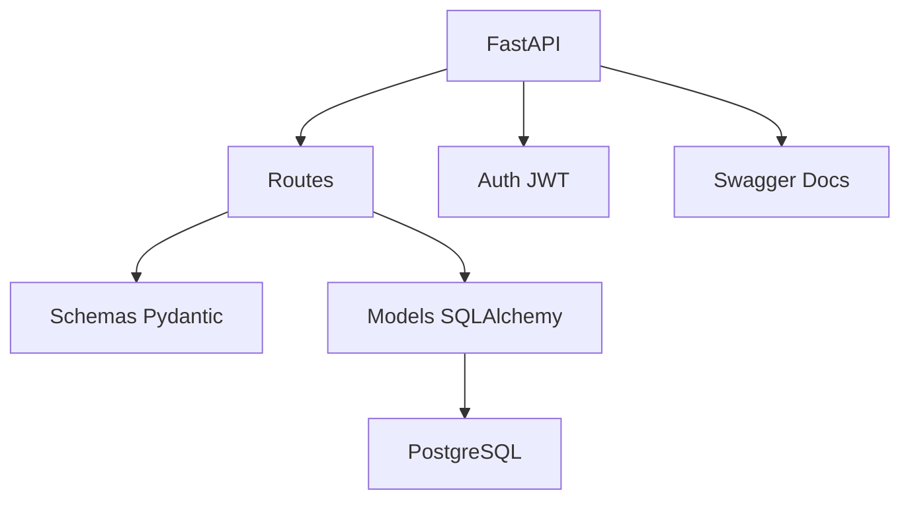

# 🔥 API PMS Protection Incendie

**API complète pour la gestion d'une entreprise spécialisée dans les systèmes de protection incendie**

[](https://fastapi.tiangolo.com/)
[](https://python.org)
[](https://postgresql.org)

## 🚀 **Démarrage Ultra-Rapide**

```bash
# Option A: Test immédiat (SQLite - aucune config)
./no-db

# Option B: Développement avec PostgreSQL (Docker)
docker-compose -f config/docker-compose.dev.yml up -d
./dev

# 🌐 Accéder à l'API
# http://127.0.0.1:8000/docs
```

## 📁 **Structure du Projet**

```
pms-efficience/
├── 📋 docs/                    # Documentation complète
├── 🚀 scripts/                # Scripts de lancement et config  
├── ⚙️  config/                 # Configuration par environnement
├── 🧪 tests/                  # Tests et exemples
├── 🏗️  models/                 # Modèles SQLAlchemy
├── 🌐 routes/                 # Routes FastAPI
├── 📝 schemas/                # Schémas Pydantic
├── 📦 uploads/               # Fichiers uploadés
└── 🔧 Core files             # main.py, config.py, etc.
```

## 🎯 **Fonctionnalités**

### **🏗️ Gestion de Projets**
- Sites clients et équipes
- Caisses et allocation ressources
- Suivi des projets incendie

### **👥 Ressources Humaines**  
- Gestion employés et tâches
- Assignations et planning
- Suivi des équipes terrain

### **📦 Gestion des Stocks**
- Inventaire temps réel  
- Mouvements de stock
- Gestion produits/articles

### **🏭 Fabrication**
- Ordres de fabrication
- Nomenclatures (BOM)
- Suivi production avec photos

### **💰 Finance & Comptabilité**
- Grand livre comptable
- Écritures comptables
- Rapports financiers

### **🚚 Logistique**
- Livraisons et approvisionnements
- Gestion véhicules
- Suivi matériel

## ⚡ **Installation & Configuration**

### **Prérequis**
- Python 3.8+ (recommandé: 3.12 avec pyenv)
- PostgreSQL (optionnel, SQLite disponible)

### **Installation Rapide**
```bash
# Cloner le projet
git clone <repository>
cd pms-efficience

# Configurer l'environnement
python3 scripts/setup_env.py dev

# Vérifier la configuration
python3 scripts/check_setup.py

# Lancer l'API
./dev
```

### **Installation Complète avec PostgreSQL via Docker (Recommandé)**
```bash
# Démarrer PostgreSQL avec Docker (simple et fiable)
docker-compose -f config/docker-compose.dev.yml up -d

# Vérifier que PostgreSQL est actif
docker-compose -f config/docker-compose.dev.yml ps

# Lancer l'API
./dev
```

<details>
<summary>Alternative: PostgreSQL local (cliquez pour développer)</summary>

```bash
# macOS avec Homebrew
brew install postgresql@15
brew services start postgresql@15
createdb pms_incendie_dev

# Lancer l'API
./dev
```
</details>

## 🛠️ **Scripts Disponibles**

| Script | Usage | Description |
|--------|-------|-------------|
| `./dev` | **Développement** | PostgreSQL + hot reload + Swagger |
| `./no-db` | **Test rapide** | SQLite temporaire (zéro config) |
| `docker-compose -f config/docker-compose.dev.yml up -d` | **Base de données** | PostgreSQL via Docker |
| `scripts/setup_env.py dev` | **Configuration** | Configure l'environnement |
| `scripts/check_setup.py` | **Diagnostic** | Vérifie la configuration |

## 🌐 **URLs d'Accès**

Une fois l'API lancée :

- **🏠 API** : http://127.0.0.1:8000
- **📖 Documentation Swagger** : http://127.0.0.1:8000/docs  
- **📘 Documentation ReDoc** : http://127.0.0.1:8000/redoc
- **💓 Health Check** : http://127.0.0.1:8000/health
- **🔧 Infos Environnement** : http://127.0.0.1:8000/environment

## 🔐 **Authentification**

```bash
# Test de connexion
curl -X POST http://127.0.0.1:8000/auth/login \
  -H "Content-Type: application/json" \
  -d '{"email":"admin@example.com","password":"password123"}'

# Utilisation du token
curl -H "Authorization: Bearer <token>" \
  http://127.0.0.1:8000/api/v1/projects
```

## 📖 **Documentation**

| Guide | Description |
|-------|-------------|
| **[🚀 Démarrage](docs/START_HERE.md)** | Guide complet de démarrage |
| **[📁 Structure](docs/STRUCTURE.md)** | Organisation du projet |
| **[🗄️ Base de données](docs/DB_SETUP.md)** | Configuration PostgreSQL |
| **[⚙️ Environnements](docs/ENVIRONMENTS.md)** | Gestion multi-environnements |

## 🧪 **Tests**

```bash
# Configuration test
python3 scripts/setup_env.py test

# Lancer les tests  
ENVIRONMENT=test pytest tests/

# Tests API
python3 tests/test_api.py
```

## 🏗️ **Architecture**



## 🔧 **Environnements**

| Environnement | Port | Base de données | Documentation |
|---------------|------|-----------------|---------------|
| **Development** | 8000 | PostgreSQL:5433 | ✅ Activée |
| **Production** | 80 | PostgreSQL:5432 | ❌ Désactivée |
| **Test** | Variable | PostgreSQL:5434 | ✅ Activée |

## 🚀 **Déploiement**

### **Développement**
```bash
./dev  # ou python3 scripts/start_dev.py
```

### **Production**  
```bash
# Configurer la production
python3 scripts/setup_env.py prod

# Éditer la configuration
vim config/.env.prod

# Lancer (nécessite sudo pour port 80)
sudo python3 scripts/start_prod.py
```

## 🤝 **Contribution**

1. Structure organisée - chaque fichier a sa place
2. Documentation complète dans `docs/`
3. Tests dans `tests/`
4. Configuration centralisée dans `config/`

## 📞 **Support**

- 📧 **Email** : alaaahriz@gmail.com
- 📋 **Issues** : [GitHub Repository](#)
- 📖 **Documentation** : `docs/`

## 📄 **Licence**

Propriétaire - PMS Protection Incendie

---

🔥 **API professionnelle prête pour la production !** 